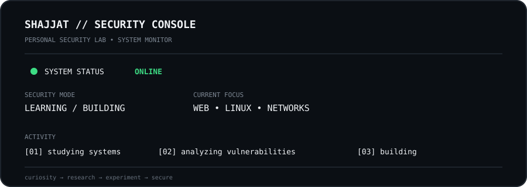

# SHAJJAT HASSAN

### CYBERSECURITY • SYSTEMS • CODE

*Curious about what happens beneath the interface —  
how systems are built, how they fail, and how they can be made more secure.*

 

`SECURITY` · `LINUX` · `NETWORKING` · `DEVELOPMENT`

---

## 01 / PROFILE

I'm a CSE student exploring the world of cybersecurity with a focus on understanding systems rather than simply using them.

My interests revolve around **security, networks, Linux, programming, and secure software development** — constantly learning, experimenting, and building along the way.

> **Break it. Understand it. Secure it.**

---
## 02 / SECURITY FOCUS

| AREA | EXPLORING |
|:---:|:---:|
| 🔐 | **Web Security** |
| 🌐 | **Network Security** |
| 🐧 | **Linux & Systems** |
| 🧩 | **Vulnerability Analysis** |
| 🛠️ | **Secure Development** |

> *Learning security means understanding both how systems work — and where they can go wrong.*

---
## 03 / TECH STACK

### LANGUAGES

`C` · `C++` · `Python` · `Java` · `JavaScript`

### WEB

`HTML` · `CSS` · `JavaScript`

### SYSTEMS & TOOLS

`Linux` · `Git` · `GitHub` · `VS Code`

### SECURITY

`Networking` · `Web Security` · `Vulnerability Analysis`

---

  <i>Tools change. Curiosity doesn't.</i>

------

## 04 / SECURITY CONSOLE

---
## 05 / CURRENTLY EXPLORING

`CYBERSECURITY` · `LINUX` · `NETWORKING` · `WEB SECURITY`

  

**Learning → Experimenting → Building**

 

Exploring how systems communicate,  
how vulnerabilities emerge, and how secure software is built.

---<!---

## 04 / SECURITY CONSOLE

-----
**hassanshajjat/hassanshajjat** is a ✨ _special_ ✨ repository because its `README.md` (this file) appears on your GitHub profile.

Here are some ideas to get you started:

- 🔭 I’m currently working on ...
- 🌱 I’m currently learning ...
- 👯 I’m looking to collaborate on ...
- 🤔 I’m looking for help with ...
- 💬 Ask me about ...
- 📫 How to reach me: ...
- 😄 Pronouns: ...
- ⚡ Fun fact: ...
-->
